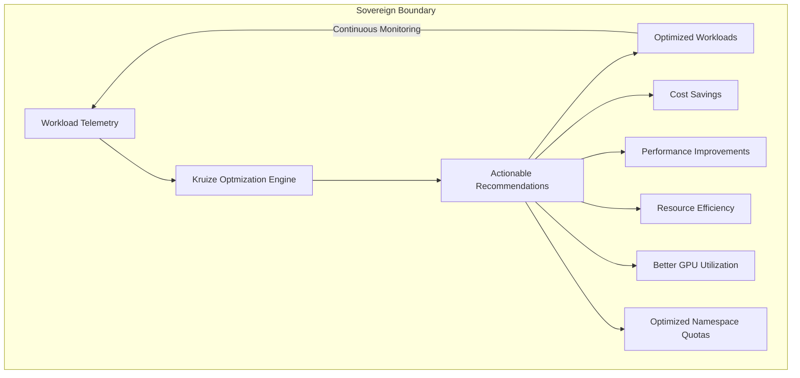
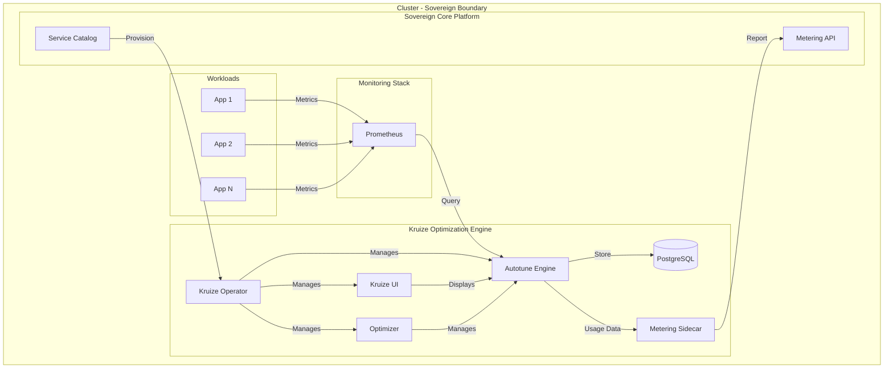
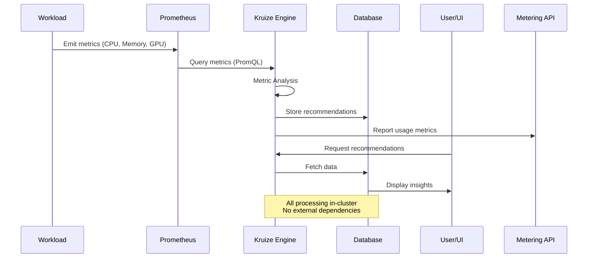

# Kruize Optimization Engine - Catalogathon Project Report

- **Project Code:** 7aa7afd3-ca2a-43e2-81a8-8f5e22900927
- **Service Name:** sccat-kruize-optimization-engine
- **Team:** Kruizers

---

---

## 📋 Table of Contents

- [Executive Summary](#executive-summary)
- [Project Achievements](#project-achievements)
- [Architecture Summary](#architecture-summary)
- [Sovereignty Readiness](#sovereignty-readiness)
- [Visual Summary / Demo Scenario](#visual-summary--demo-scenario)
- [Project Difficulties and Findings](#project-difficulties-and-findings)
- [Catalog Post Mortem](#catalog-post-mortem)
- [Appendix](#appendix)

---

## 🎯 Executive Summary

**Kruize Optimization Engine** is an Kubernetes resource optimization platform that delivers intelligent, continuous recommendations to maximize application performance while minimizing infrastructure costs—all within the sovereign boundary.

### Why Kruize for Sovereign Core?

### Value Proposition

| Dimension | Impact | Benefit |
|-----------|--------|---------|
| **💰 Cost Optimization** | Significant cost reduction | Right-size resources, eliminate waste |
| **⚡ Performance** | Better performance | Optimize CPU, memory, GPU allocation |
| **🔒 Sovereignty** | 100% in-cluster | No external dependencies, full data control |
| **🤖 Real-time** | Continuous monitoring | Adaptive recommendations based on actual usage |
| **🎯 Multi-Dimensional** | Unified platform | CPU, memory, GPU, namespace quotas |

---

## Project Achievements

### Achievements

✅ **Successfully Delivered a Production-Ready Kubernetes Optimization Platform**

We successfully integrated Kruize Optimization Engine into the IBM Sovereign Core ecosystem, delivering:

1. **Complete Operator-Based Deployment**
   - Custom Kruize CRD for declarative instance management
   - Automated lifecycle management via Kubernetes operator
   - GitOps-ready with ArgoCD ApplicationSet support

2. **Multi-Dimensional Optimization Capabilities**
   - CPU and Memory right-sizing with continuous recommendations
   - Namespace quota optimization for cluster-wide efficiency
   - GPU allocation recommendations for AI/ML workloads
   - Java runtime tuning (JVM heap, GC optimization)
   - VPA integration for enhanced autoscaling

3. **Full Sovereign Core Compliance**
   - 100% in-cluster processing (zero external dependencies)
   - Rootless containers (all UIDs ≥ 1000)
   - Complete SBOM for all 5 container images
   - Metering integration via sidecar pattern 
   - Resource limits: 2.5 CPU, 1.8Gi RAM (Minimum)

4. **Production-Grade Security**
   - Pod Security Standards (Restricted profile)
   - All capabilities dropped, privilege escalation disabled
   - Read-only filesystems where applicable
   - Namespace-scoped RBAC only
   - Secretless submission with pre-provisioned credentials

5. **Comprehensive Documentation**
   - Detailed README with architecture diagrams
   - Security hardening guide
   - Metering integration documentation 
   - CVE handling strategy
   - Day 2 operations playbook
   - Troubleshooting guide

### Pending Design and Steps

**Future Enhancements:**

1. **Enhanced Observability**
   - Add custom Prometheus metrics for all components
   - Create Grafana dashboards for visualization
   - Add AlertManager rules for proactive monitoring

2. **Advanced Optimization Features**
   - Multi-cluster optimization recommendations
   - Integration with FinOps tools

3. **Scalability Improvements**
   - Caching layer for frequently accessed recommendations

4. **Additional Metering Metrics**
   - Track recommendation acceptance rate
   - Measure actual cost savings achieved

### Architecture Summary

#### System Architecture

#### Component Breakdown

| Component | Purpose | Resources | Security |
|-----------|---------|-----------|----------|
| **Kruize Operator** | Lifecycle management, CRD controller | 0.5 CPU, 128Mi RAM | Non-root (UID 1000), no privileges |
| **Autotune Engine** | Metrics collection, analysis | 0.7 CPU, 768Mi RAM | Non-root (UID 1001), read-only FS |
| **Optimizer** | Automatic Recommendation generation | 0.5 CPU, 512Mi RAM | Non-root (UID 1002), capabilities dropped |
| **PostgreSQL** | Persistent storage for recommendations | 0.5 CPU, 100Mi RAM | Non-root (UID 999), encrypted storage |
| **Kruize UI** | Web dashboard, visualization | 0.2 CPU, 256Mi RAM | Non-root (UID 1003), CSP headers |
| **Metering Sidecar** | Usage tracking, Sovereign Core integration | 0.1 CPU, 64Mi RAM | Non-root (UID 1004), minimal permissions |

**Total Resources:** 2.5 CPU, 1.8Gi RAM (31% of 8 CPU limit) ✅

#### Data Flow Architecture

#### Component Interactions

1. **Data Collection Flow:**
   - Workloads emit metrics → Prometheus collects
   - Autotune queries Prometheus via PromQL
   - Metrics analyzed for usage patterns

2. **Recommendation Generation:**
   - Autotune processes metrics and stores in PostgreSQL
   - Optimizer generates recommendations every 15 minutes
   - Multiple options: cost-optimized, performance-optimized

3. **User Interaction:**
   - Kruize UI displays recommendations
   - Users can view historical trends
   - Export recommendations for manual application
   - UI route is secured via Openshift Auth

4. **Metering Integration:**
   - Metering sidecar scrapes Autotune metrics endpoint
   - Usage data posted to Sovereign Core Metering API
   - Tracks: experiments generated

5. **Lifecycle Management:**
   - Operator watches Kruize CRD instances
   - Manages deployment of all components
   - Handles upgrades and configuration changes

#### Container Images

All images hosted in IBM dev registry:

| Component | Image | Tag |
|-----------|-------|-----|
| Operator | `dev-registry-quay-catalogathon-registry.apps.hthon-dev.svl.ibm.com/sccat-7aa7afd3-ca2a-43e2-81a8-8f5e22900927/kruize-operator` | `catalogathon` |
| Autotune | `dev-registry-quay-catalogathon-registry.apps.hthon-dev.svl.ibm.com/sccat-7aa7afd3-ca2a-43e2-81a8-8f5e22900927/autotune` | `catalogathon` |
| Optimizer | `dev-registry-quay-catalogathon-registry.apps.hthon-dev.svl.ibm.com/sccat-7aa7afd3-ca2a-43e2-81a8-8f5e22900927/optimizer` | `catalogathon` |
| UI | `dev-registry-quay-catalogathon-registry.apps.hthon-dev.svl.ibm.com/sccat-7aa7afd3-ca2a-43e2-81a8-8f5e22900927/kruize-ui` | `catalogathon` |
| PostgreSQL | `dev-registry-quay-catalogathon-registry.apps.hthon-dev.svl.ibm.com/sccat-7aa7afd3-ca2a-43e2-81a8-8f5e22900927/postgres` | `catalogathon` |

#### 🎯 Core Optimization Capabilities

1. **CPU & Memory Right-Sizing**
- **Intelligent Analysis**: Usage-based workload profiling
- **Continuous Recommendations**: Auto-generated every 15 minutes
- **Multi-Profile Support**: Cost-optimized, performance-optimized

2. **Namespace Quota Optimization**
- **Cluster-Wide Analysis**: Identify over/under-provisioned namespaces
- **Quota Recommendations**: Right-size namespace resource quotas

3. **GPU Allocation Intelligence**
- **GPU Workload Detection**: Identify GPU-intensive applications
- **Fractional GPU Recommendations**: Optimize GPU sharing
- **Cost-Performance Trade-offs**: Balance GPU allocation vs. cost

4. **Java Runtime Tuning**
- **JVM Heap Optimization**: Right-size heap based on actual usage
- **GC Tuning**: Optimize garbage collection parameters

5. **VPA Integration**
- **Seamless Integration**: Works alongside Vertical Pod Autoscaler

6. Continuous Optimization Loop
- **Auto-generated recommendations**: Every 15 minutes automatically generates new recommendations

7. **Recommendation Options**

| Profile | Use Case | Optimization Goal | Risk Level |
|---------|----------|-------------------|------------|
| **Cost-Optimized** | Non-critical workloads | Minimize resource allocation | Low |
| **Performance-Optimized** | Latency-sensitive apps | Maximize headroom | Very Low |
| **Custom** | Specific requirements | User-defined constraints | Variable |

### Sovereignty Readiness

#### ✅ Complete Compliance Matrix

| Principle | Implementation | Status | Evidence |
|-----------|----------------|--------|----------|
| **Data Sovereignty** | All data processed in-cluster, no external calls | ✅ | [Architecture](#architecture-summary) |
| **Operational Sovereignty** | Full lifecycle management via operator | ✅ | [Operator Design](../services/sccat-kruize-optimization-engine/v1/manifests/operator-deployment.yaml) |
| **Security Sovereignty** | Rootless, least privilege, encrypted storage | ✅ | [SECURITY.md](../services/sccat-kruize-optimization-engine/v1/SECURITY.md) |
| **Compliance Sovereignty** | SBOM, CVE tracking, audit logs | ✅ | [SBOM Directory](../services/sccat-kruize-optimization-engine/v1/sbom/) |
| **Resource Sovereignty** | Within 8 CPU, 100GB limits | ✅ | [Resource Allocation](#component-breakdown) |
| **Namespace Isolation** | Namespace-scoped RBAC only | ✅ | [RBAC Manifests](../services/sccat-kruize-optimization-engine/v1/manifests/) |
| **Secret Management** | Pre-provisioned, external secrets support | ✅ | [Secret Strategy](../services/sccat-kruize-optimization-engine/v1/SECURITY.md#secret-management-approach-strongly-recommended) |
| **Metering Integration** | Sidecar pattern, Sovereign Core API | ✅ | [METERING.md](../services/sccat-kruize-optimization-engine/v1/METERING.md) |
| **Observability** | Prometheus integration, structured logging | ✅ | [OBSERVABILITY.md](../services/sccat-kruize-optimization-engine/v1/OBSERVABILITY.md) |
| **GitOps Ready** | Kustomize-based, ArgoCD compatible | ✅ | [Deployment Guide](../services/sccat-kruize-optimization-engine/v1/README.md#deployment-guide) |

#### What We Delivered for Sovereignty

1. **Zero External Dependencies**
   - All processing happens within the cluster boundary
   - No external API calls or data egress
   - Self-contained optimization engine

2. **Data Sovereignty**
   - All telemetry data stays in-cluster
   - Recommendations stored in local PostgreSQL
   - No data sent to external services

3. **Operational Sovereignty**
   - Full control via Kubernetes operator
   - Declarative configuration through CRDs
   - GitOps-compatible deployment model

4. **Security Sovereignty**
   - Rootless containers (UIDs 1000-1004)
   - No privileged operations required
   - Namespace-scoped permissions only
   - Pre-provisioned secrets (no embedded credentials)

5. **Compliance Sovereignty**
   - Complete SBOM in SPDX format
   - CVE tracking and management strategy
   - Apache 2.0 license (no GPL dependencies)
   - Audit-ready logging

#### 📦 Software Bill of Materials (SBOM)

Complete SPDX-format SBOMs for all components:

- [`kruize-operator-catalogathon-sbom.json`](../services/sccat-kruize-optimization-engine/v1/sbom/kruize-operator-catalogathon-sbom.json) - Operator image
- [`autotune-catalogathon-sbom.json`](../services/sccat-kruize-optimization-engine/v1/sbom/autotune-catalogathon-sbom.json) - Autotune engine
- [`optimizer-catalogathon-sbom.json`](../services/sccat-kruize-optimization-engine/v1/sbom/optimizer-catalogathon-sbom.json) - Optimizer service
- [`kruize-ui-catalogathon-sbom.json`](../services/sccat-kruize-optimization-engine/v1/sbom/kruize-ui-catalogathon-sbom.json) - Web UI
- [`postgres-catalogathon-sbom.json`](../services/sccat-kruize-optimization-engine/v1/sbom/postgres-catalogathon-sbom.json) - Database

#### Implementation Highlights

**Security Hardening:**
- All containers run as non-root users
- `allowPrivilegeEscalation: false` enforced
- All Linux capabilities dropped
- Read-only root filesystems where possible
- Pod Security Standards: Restricted profile

**Resource Management:**
- Total resource footprint: 2.5 CPU, 1.8Gi RAM
- Well within 8 CPU, 100GB limits
- Efficient resource utilization (31% of CPU limit)

**Metering Integration:**
- Sidecar pattern implementation (Approach 2)
- Tracks `kruize.experiments.generated` metric
- Automatic reporting to Sovereign Core Metering API

### Visual Summary / Demo Scenario

#### Deployment Workflow

*Screenshot placeholder: ArgoCD deployment in progress*

#### Optimization in Action

*Screenshot placeholder: Kruize UI showing recommendations*

#### Metering Data Flow

*Screenshot placeholder: Metering sidecar logs showing successful POST*

#### Resource Optimization Results

*Screenshot placeholder: Before/after resource allocation comparison*

---

## Project Difficulties and Findings

### Development Limitations

1. **Hardware Constraints**
   - Required careful resource optimization
   - **Solution:** Implemented efficient resource requests/limits, used lightweight PostgreSQL configuration

2. **Testing Environment**
   - Limited access to full OpenShift cluster for testing
   - Had to rely on kind for local development
   - **Solution:** Created portable manifests that work on both kind and OpenShift

3. **Learning Curve**
   - Understanding Sovereign Core constraints and requirements
   - Metering API integration patterns
   - Secret management approaches
   - **Solution:** Thorough review of catalogathon guide, reference implementations

### Technical Challenges

1. **Operator Development**
   - **Challenge:** Building a production-ready Kubernetes operator from scratch for sovereign core
   - **Impact:** Significant development time for CRD design and controller logic
   - **Solution:** Leveraged Operator SDK, implemented reconciliation loops with proper error handling
   - **Lesson:** Start with operator framework early, test reconciliation thoroughly

2. **Metering Sidecar Integration**
   - **Challenge:** Implementing sidecar pattern without modifying upstream Kruize code
   - **Impact:** Required careful coordination between main container and sidecar
   - **Solution:** Query metrics with APIs, implemented periodic logic in sidecar
   - **Lesson:** Sidecar pattern is powerful but requires careful lifecycle management

3. **Secret Management**
   - **Challenge:** Secretless submission requirement vs. database credential needs
   - **Impact:** Cannot include secrets in manifests
   - **Solution:** Pre-provisioned secrets approach, documented External Secrets Operator integration
   - **Lesson:** Clear documentation of secret requirements is critical

4. **GitOps Compatibility**
   - **Challenge:** Making deployment ArgoCD-friendly
   - **Impact:** Required Kustomize overlays, ApplicationSet templates
   - **Solution:** Created template structure, tested with ArgoCD
   - **Lesson:** Design for GitOps from the start, not as an afterthought

---

## Catalog Post Mortem

### What We Liked

✅ **Clear Guidelines and Constraints**
- The catalogathon guide was comprehensive and well-structured
- Sovereignty principles were clearly defined
- Resource limits helped focus on efficiency

✅ **Real-World Relevance**
- Solving actual enterprise problems (resource optimization)
- Practical constraints mirror production environments
- Emphasis on security and compliance

✅ **Technical Learning**
- Deep dive into Kubernetes operators
- Hands-on experience with GitOps patterns
- Understanding of sovereign computing principles

✅ **Documentation Focus**
- Emphasis on clear documentation improved our practices
- SBOM and security requirements raised awareness
- Metering integration taught us about usage tracking

### What Could Be Improved

⚠️ **Development Environment Access**
- Limited access to full OpenShift cluster/ Soverign Environments for testing
- **Suggestion:** Provide shared development clusters or better local testing tools, a demo on already provisioned soverign environment could help a lot

⚠️ **Feedback Loop**
- Would benefit from interim checkpoints or reviews
- **Suggestion:** Optional mid-catalogathon review sessions

⚠️ **Metering API Documentation**
- Could use more examples and edge cases
- **Suggestion:** Expand metering integration guide with troubleshooting section

### Suggestions for Future Catalogathons

1. **Tiered Complexity Levels**
   - Offer "starter," "intermediate," and "advanced" tracks
   - Allow teams to choose based on experience level

2. **Extended Timeline Option**
   - Consider offering extended timeline for complex services
   - Or provide "fast track" for simpler integrations

3. **Pre-Event Workshops**
   - Development basics
   - GitOps patterns and best practices
   - Security hardening techniques

4. **Post-Event Support**
   - Guidance on productionizing submissions
   - Path to actual Sovereign Core catalog inclusion

### Overall Experience

**Rating: 9/10**

The catalogathon was an excellent learning experience that pushed us to think deeply about:
- Kubernetes-native application design
- Security-first development
- Operational excellence
- Documentation quality

The constraints were challenging but fair, and the focus on sovereignty principles is highly relevant for enterprise deployments. We successfully delivered a production-ready optimization platform that we're proud of.

**Key Takeaway:** Building for sovereign environments requires careful attention to security, resource efficiency, and operational simplicity—all valuable lessons for any cloud-native development.

---

## Appendix

### Quick Links

- **Main README:** [../services/sccat-kruize-optimization-engine/v1/README.md](../services/sccat-kruize-optimization-engine/v1/README.md)
- **Security Guide:** [../services/sccat-kruize-optimization-engine/v1/SECURITY.md](../services/sccat-kruize-optimization-engine/v1/SECURITY.md)
- **Manifests:** [../services/sccat-kruize-optimization-engine/v1/manifests/](../services/sccat-kruize-optimization-engine/v1/manifests/)
- **SBOM Directory:** [../services/sccat-kruize-optimization-engine/v1/sbom/](../services/sccat-kruize-optimization-engine/v1/sbom/)

### Contact Information

- **Project Repository:** https://github.com/kruize/autotune
- **Operator Repository:** https://github.com/kruize/kruize-operator
- **Community:** https://github.com/kruize/autotune/discussions

 

**🏆 Built for IBM Sovereign Core Catalogathon 2026**

*Transforming Kubernetes optimization with intelligence inside the sovereign boundary*

